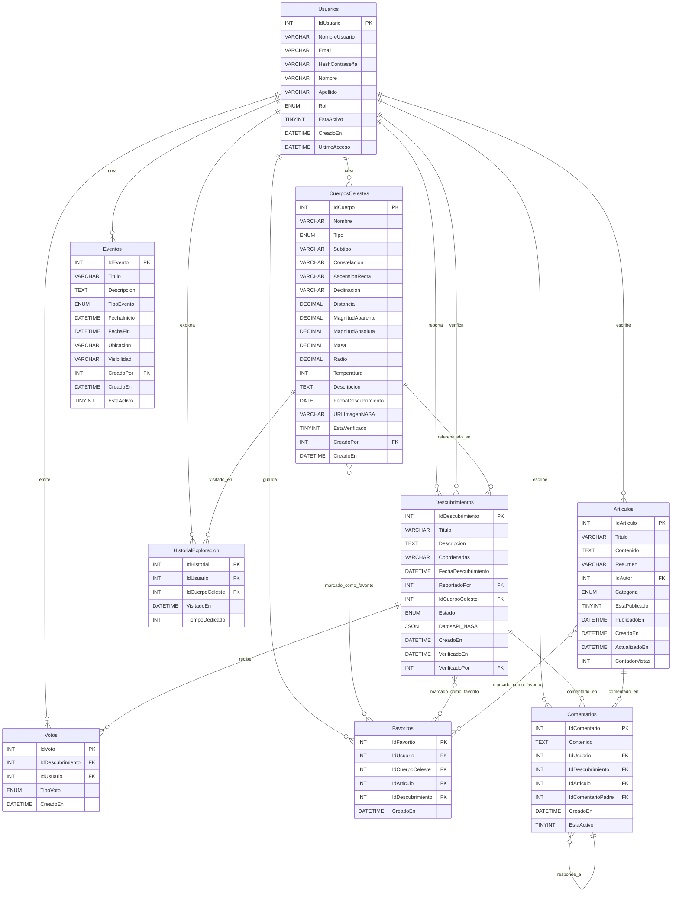

<h1 align="center"> E.T. Nº12 D.E. 1º "Libertador Gral. José de San Martín" </h1>

  

# Computación : 2025

**Asignatura**: Desarrollo de Sistemas

**Nombre TP**: Trabajo Final 

**Apellidos y Nombres Alumnos**: Josu Guzman - Hernan Vazquez

**Curso**: 6 ° 7

# 🌌 Observatorio El Paranal – Proyecto Final  

Aplicación web interactiva para la **exploración y estudio de galaxias, estrellas, planetas y fenómenos astronómicos**.  
El sistema integra datos reales de **APIs astronómicas (NASA, ESA, Hubble, JPL)** y ofrece herramientas de visualización y análisis científico.

## 🚀 Características

## 🧱 Estructura de Clases

## 📦 Requisitos

## ▶️ Ejecución

# Diagrama de Clases del Proyecto

